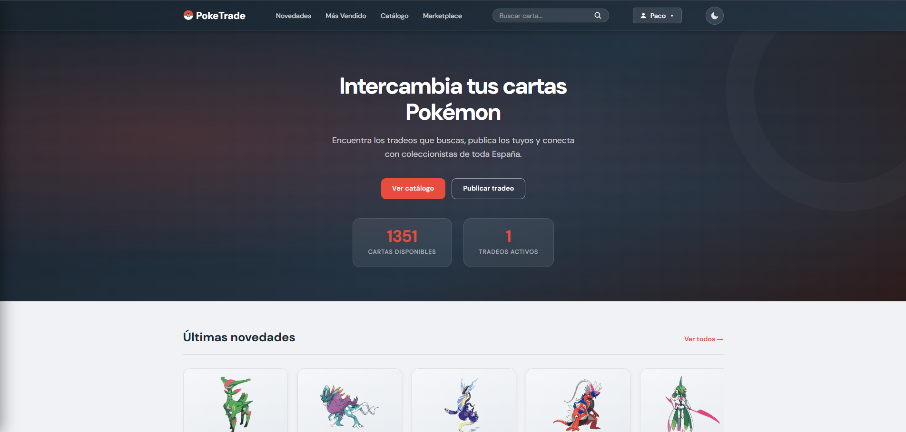
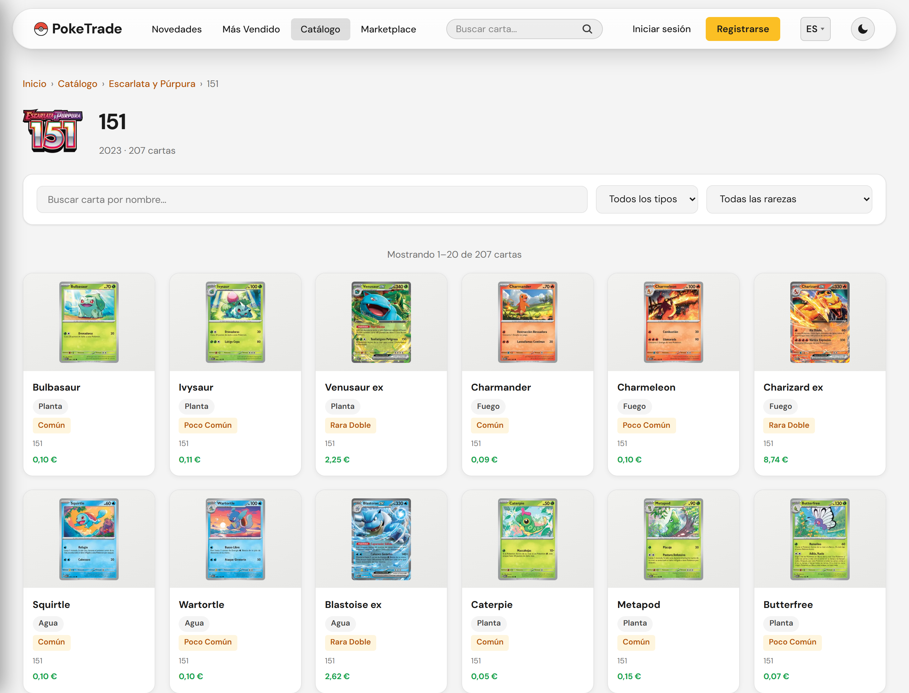
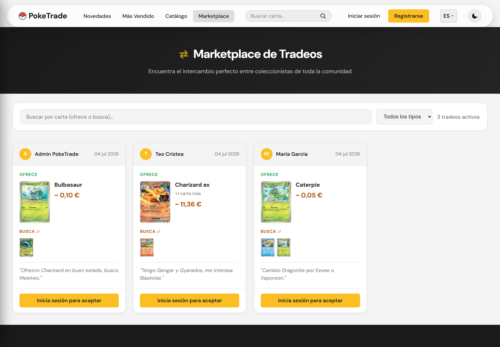
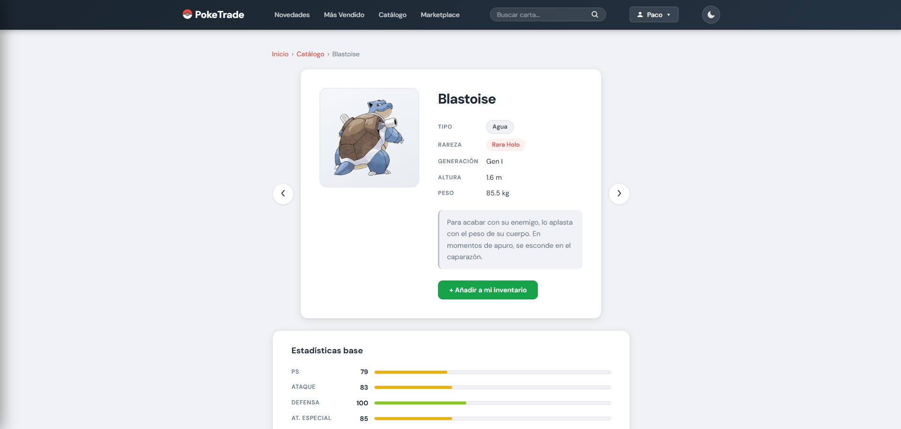

# PokeTrade

> A full-stack Pokémon card trading platform — browse the complete TCG catalog by expansion set, build your collection, and trade with other collectors.

[](LICENSE)


**Live demo: [poketrade-beryl.vercel.app](https://poketrade-beryl.vercel.app)**
> The backend runs on a free tier and sleeps after inactivity — the first request may take ~30–50s to wake up.



---

## About

PokeTrade is a full-stack web application where collectors register their Pokémon TCG cards, publish trade offers, and accept offers from other users. It combines a custom REST API (Laravel 12, JWT auth) with an external public API (TCGdex v2) that feeds the card catalog with real trading cards: official illustrations, sets, rarities, illustrators and Cardmarket prices.

The frontend and backend are fully decoupled: a vanilla JavaScript client (no framework, no build step) talks to the API exclusively over HTTP/JSON.

This project was developed as the final project (Trabajo de Fin de Grado) for the Higher Technical Degree in Web Application Development (DAW).

## Features

- JWT authentication — register, login, logout, protected routes
- User profile — view/edit profile, change password
- Card catalog — server-side paginated listing and detail view of real TCG cards (official illustration, set and collector number, illustrator, HP, Cardmarket average price in EUR), with filters by name, type and rarity (case-insensitive search) built from the actual database values
- Full TCG catalog by expansion — browse every series and set ever published (~21 series, ~214 sets) with breadcrumb navigation: series → sets (logo, year, card count) → paginated card grid. Card data is cached on demand per set, so any card of any set can be collected and traded
- Illustration zoom — clicking any card illustration opens an accessible lightbox with the high-quality image (low-res placeholder while it loads, arrow-key navigation between cards, focus trap, Escape/outside-click close)
- Personal inventory — add cards from the catalog, remove them, manage quantities
- Trades (the core feature) — publish a trade (offered cards are withdrawn from inventory inside a DB transaction), browse a public marketplace, and accept trades with an atomic card swap between both users' inventories
- Admin role — card CRUD and user management behind role middleware
- Accessibility — WCAG 2.1 AA: focus trap in modals, ARIA attributes, keyboard navigation, skip-to-content link

## Screenshots

| Catalog | Marketplace | Card detail |
|---|---|---|
|  |  |  |

## Tech Stack

| Layer | Technology |
|---|---|
| Backend | Laravel 12 (PHP 8.2) |
| Auth | JWT (tymon/jwt-auth) |
| Frontend | Vanilla JavaScript (ES6 modules), HTML5, CSS3 — no framework, no build |
| External API | TCGdex v2 (card data, seeded into the DB) |
| Database | SQLite (local) · PostgreSQL / Supabase (production) |
| Testing | PHPUnit (in-memory SQLite) |
| Deployment | Render (backend) · Vercel (frontend) · Supabase (database) |

## Architecture & Deployment

Decoupled client–server architecture. The frontend and backend are deployed independently and communicate over a REST API:

```
Browser (Vercel)  --HTTP/JSON-->  Laravel REST API (Render)  -->  PostgreSQL (Supabase)
                                            |
                                            +-->  TCGdex API v2 (sync command & cache-aside, cached 24 h)
```

### Card catalog: lightweight index + cache-aside

The full TCG catalog is ~130k cards, so it is **not** stored upfront. Instead:

1. **Series/sets index** — `php artisan tcgdex:sync-sets` seeds a lightweight index (~21 series, ~214 sets: name, logo, release date, card count). It is idempotent and walks **every** TCGdex catalog: each pass writes its own name column (`nombre_es`, `nombre_en`) and adds whatever that catalog has and the previous one lacked (some old sets were never translated). Run it once after deploying and re-run whenever new sets are released.
2. **Cards on demand, one language at a time (cache-aside)** — the first time anyone opens a set **in a given language**, `GET /api/sets/{id}/cartas` fetches that catalog from TCGdex (a single request), persists it inside a DB transaction and records the language in `idiomas_sincronizados`; every later visit in that language is served straight from the database. A set nobody has opened in English never spends a request getting translated. If TCGdex is down, the endpoint returns a clear 503 and the set is never left half-cached.
3. **Lazy detail hydration, also per language** — cards enter the DB with just name, number and image; the first time a card's detail page is opened in a language, `GET /api/cartas/{id}` completes rarity, type, price and description from that catalog and persists them.

What gets stored per language is only what actually differs: `nombre`, `descripcion` and the illustration (the TCGdex asset carries the language in its path, because the artwork contains the card's printed text). Types and rarities are a **closed set**, so they are stored as a canonical key and translated from a dictionary (`lang/{es,en}/tcg.php`) — zero DB growth. Everything else (price, HP, illustrator, card number) is language-neutral.

TCGdex's answers are distinguished three ways, which is what makes the per-language cache work: the data, `404` (*this catalog does not have it, and never will* — cached, so we stop asking for the Spanish version of Base Set) and *no answer at all* (a 5xx or a timeout — not cached, so it is retried).

The browser never talks to TCGdex directly, and all external responses are cached server-side for 24 h. `cartas:sincronizar-tcgdex [--idioma=en]` still refreshes prices/data of already-stored cards on demand.

### The language lives in the URL

```
/pages/catalogo.html        → Spanish (the default: no prefix, so every URL that already existed still works)
/en/pages/catalogo.html     → English
```

Both URLs serve **the same HTML file** — a Vercel rewrite (`/en/:path*` → `/:path*`) strips the prefix, so there is no second copy of anything to keep in sync. Two consequences fall out of that:

- **Every internal link is relative**, so the prefix propagates by itself: `../index.html` from `/en/pages/catalogo.html` resolves to `/en/index.html`. No link-rewriting layer was needed.
- **`canonical` and `hreflang` have to be computed client-side**, because the same file is served at two URLs and a static `canonical` would point *both* at the Spanish one — which would get the English version dropped from the index, the exact opposite of the goal. The `hreflang` cluster also ships in `sitemap.xml`, which is static and needs no JavaScript; the injected `<link>` tags are the second belt, not the only one.

**There is no automatic redirect based on the browser's language.** Googlebot renders with a Chrome set to English and no `localStorage`, so bouncing visitors by `navigator.language` would bounce Googlebot out of *every* Spanish URL and Google would end up indexing half the site. Google explicitly advises against it. The language selector sits in the header, which is what they recommend instead. A visitor who has explicitly picked a language *is* sent to their URL — that trigger is the stored choice, which a crawler never has.

**Excluded catalogs** — `config/tcgdex.php` holds a `series_excluidas` list (currently `tcgp` Pokémon Pocket, `mc` McDonald's, `tk` Trainer Kits: non-physical or asset-less catalogs). Adding a serie id there requires no code changes: the sync skips it, the global search filters its cards out, and `php artisan tcgdex:purgar-excluidos` (dry-run by default, `--force` to apply) removes anything already imported, including inventories and trades that reference those cards.

### Catalog & expansion endpoints

| Method & path | Description |
|---|---|
| `GET /api/series` | All series, newest first, with set counts |
| `GET /api/series/{id}` | One serie with its sets (accepts TCGdex or internal ID) |
| `GET /api/sets` | All sets, `?serie=X` to filter |
| `GET /api/sets/{id}` | Set header info (logo, release date, card count) |
| `GET /api/sets/{id}/cartas` | Paginated cards of a set — triggers the on-demand caching |
| `GET /api/cartas/{id}` | Card detail — triggers lazy hydration from TCGdex |

### Cold starts, and being honest about them

The API runs on Render's free tier, which shuts the service down after a while with no traffic. The next visitor waits for the whole container to come back up — up to a minute. No amount of code fixes that; it is what a free plan buys you. Two things follow.

**Make the boot as short as it can be.** The container's start command runs on *every* wake, and the port does not open until it finishes, so everything in there is paid for by a visitor. It used to chain four `artisan` calls, and each one boots the whole framework (~450 ms on a normal CPU; Render's free tier gives **0.1 CPU**). Now `route:cache`, `event:cache` and `view:cache` happen at **build** time — they don't depend on the environment, which is exactly why they work with no `.env`, and there is none inside the image — and `config:cache` (which *does* bake the environment, so it cannot move to build) shares a single process with the migrations via `php artisan app:arrancar`. **Four Laravel boots down to one: 1,710 ms → 524 ms.**

**And tell the visitor what is happening.** A muted skeleton for sixty seconds looks like a broken site. After 3 seconds a notice explains the situation, with a clock so it's visibly making progress rather than visibly hung. It lives inside `apiFetch`, so every call in the app has it, along with a 90 s timeout and an automatic retry on the `502/503/504` Render's proxy returns while the container is still coming up (GET and HEAD only — retrying a `POST /tradeos` could publish the trade twice).

**`GET /api/health`** is the cheapest endpoint there is: no database, no TCGdex, no cache. A 200 means PHP booted, Laravel booted and the routes are mounted — and *only* that. Checking the database here would make a Supabase outage look like an API outage, and they are not the same thing. (Laravel's own `/up` exists but sits outside the API group, so no CORS: a browser can't call it.)

**Keeping it awake — proposed, not enabled.** A cron ping against `/api/health` every 10 minutes would keep the service up (10 and not 14, because GitHub Actions' scheduler runs late by 5–15 minutes under load, and Render sleeps at 15). The catch is the free-hour budget: Render gives **750 instance-hours a month**. Awake 24/7 is ~730 h — it eats essentially all of them and leaves nothing for anything else. A bounded window (say 08:00–22:00) is **~426 h**, which fits with room to spare. Worth doing only if the demo is being actively shown; it is off by default.

### Load performance

Measured in a real browser on throttled slow-4G (150 ms RTT, 4× CPU slowdown), which is where round trips actually cost something. Three things were wrong, and none of them were "too many bytes" — brotli takes the 123 KB stylesheet down to 20 KB.

| | before | after |
|---|---|---|
| First paint, `/` | 904 ms | **732 ms** |
| First paint, `/en/` | 1272 ms | **856 ms** |
| `load` | 1448 ms | **1219 ms** |

1. **The dictionary was a dead round trip at the end of the chain.** `i18n.js` loads it with a dynamic `import()`, so the browser's preload scanner cannot see it — it only started downloading once the *whole* module graph had landed, and nothing renders until it does. It now ships as a `<link rel="modulepreload">` injected by the boot script, which is the only code that knows the active language. The core modules get static `modulepreload` hints for the same reason: `header.js → auth.js → config.js` was three sequential round trips. All of it now downloads in parallel.
2. **The font was loaded with an `@import` inside the stylesheet** — the worst option available. The `@import` isn't discovered until the CSS has been downloaded *and parsed*, and it then chains two fresh cross-origin connections (`fonts.googleapis.com`, then `fonts.gstatic.com`), each with its own DNS lookup and TLS handshake. DM Sans is now self-hosted: no third parties, no new connections, and one less thing for the privacy policy to declare. It is deliberately **not** preloaded — 61 KB competing with the render-blocking CSS pushed first paint 130 ms *later*, and `font-display: swap` means it was never blocking anything.
3. **Production ran `php artisan serve`**, PHP's development server, which handles **one request at a time**. The catalogue fires three API calls in parallel and they were queueing: measured at 493 ms in parallel versus 497 ms in series — no parallelism at all. Fixed with `PHP_CLI_SERVER_WORKERS` (which `ServeCommand` silently ignores unless you also pass `--no-reload`). OPcache was not installed either, so PHP recompiled all of Laravel on every request, and `config:cache`/`route:cache` were never run. All three are one-line changes in the Dockerfile.

The API itself was fine: 1–6 queries per endpoint, no N+1 (a card always travels with its set, eagerly loaded).

## Technical Highlights

- Bilingual (Spanish/English), no i18n library — the UI runs on a hand-rolled dictionary with `Intl.PluralRules` and `Intl.NumberFormat` (so `12,50 €` and `€12.50` are the same number, and a third language's plural rules will not silently break); the API negotiates `Accept-Language` and answers with `Content-Language` + `Vary`; and the card data lives in per-language columns filled lazily. Adding a language means editing one dictionary.
- Atomic trades with race-condition protection — accepting a trade runs inside a database transaction and uses `lockForUpdate()` to prevent two users from accepting the same trade simultaneously (double-spend).
- N+1 prevention — eager loading of relationships on listing endpoints (a card always travels with its set, which is where its translated expansion name comes from).
- XSS-safe rendering — systematic HTML escaping and `textContent` for all user-provided data on the client.
- Cross-database compatibility — driver-aware query operators so the same code runs on SQLite (local) and PostgreSQL (production).
- Accessibility-first — keyboard-navigable modals with focus management, not just visual styling.

## Local Setup

Backend
```bash
cd api
composer install
cp .env.example .env
php artisan key:generate
php artisan jwt:secret
php artisan migrate --seed
php artisan tcgdex:sync-sets # series/sets index for the expansions browser (~3 min the first time)
php artisan serve            # http://localhost:8000
```

Frontend (must be served over HTTP, not `file://`)
```bash
node tools/servidor.mjs     # http://localhost:5500 · and /en/ for the English version
```

Use this one rather than Live Server or `npx serve`: it reproduces the two things `vercel.json` does and a plain static server does not — the `/en/:path*` → `/:path*` rewrite (without it the English URLs are a 404, because there is no second copy of the HTML to serve) and no clean-URL redirects (`npx serve`'s 301 drops the query string, so `?set=sv03.5` reaches the app empty). No dependencies, just Node.

If you do serve the site some other way and it ends up under a subdirectory, the language still works — it just falls back to being state rather than living in the URL.

Running `php artisan migrate --seed` populates your local database with a starter card catalog (two curated sets fetched once from TCGdex) plus sample users, inventories and trades so you can explore the app right away during development. `php artisan tcgdex:sync-sets` adds the series/sets index so the expansions browser works; the cards of any other set are cached automatically the first time you open it. In production only the catalog is set up (`php artisan db:seed --class=CartasSeeder --force` plus `php artisan tcgdex:sync-sets`, which needs no `--force` because it has no environment guard); no demo users are created, so on the live demo you can simply sign up to try it.

After a deploy that changes the schema, run `php artisan cache:clear`: the `cache` table survives deploys, and anything cached from the old schema would be served for up to an hour.

## Testing

```bash
cd api
php artisan test            # 92 tests, in-memory SQLite (TCGdex mocked with Http::fake)
```

## License

[MIT](LICENSE)
