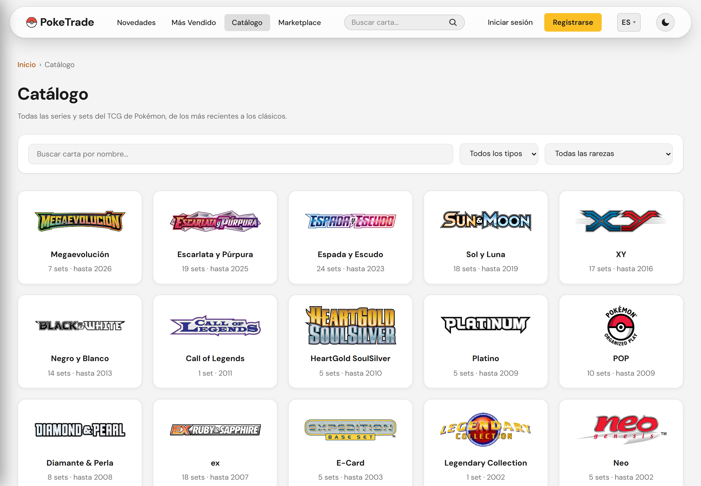
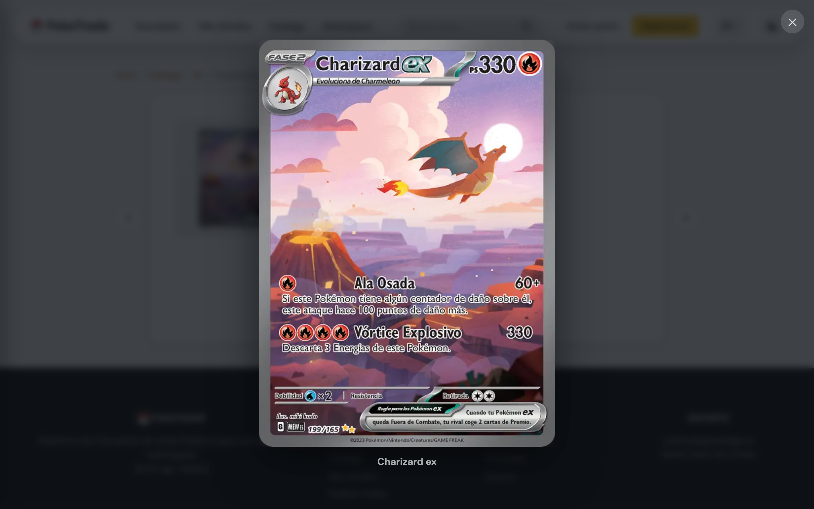
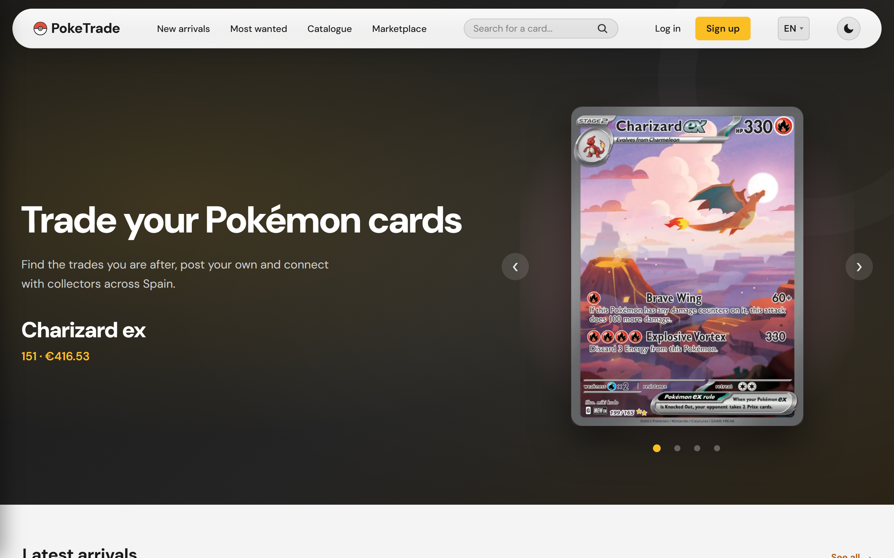

# PokeTrade

**Browse every Pokémon TCG expansion ever printed, build a collection, and trade cards with other collectors.**

[](LICENSE)


### ▶︎ [poketrade-beryl.vercel.app](https://poketrade-beryl.vercel.app)

> **The first load can take up to a minute.** The API sits on Render's free tier, which shuts the container down after a while with no traffic, and the next visitor pays for it waking back up. The app tells you so on screen, with a clock, instead of showing a mute skeleton — see [Cold starts](#cold-starts-shortened-and-explained). Everything after that is instant.
>
> Available in **Spanish and English** (the selector is in the header).


---

## What it is

A full-stack web app where collectors register the Pokémon cards they own, publish trade offers, and accept offers from other users.

The card catalog is real: it comes from [TCGdex](https://tcgdex.dev), a public API covering **20,386 cards across 167 sets and 18 series** — every expansion printed since 1999, with official artwork, rarities, illustrators and Cardmarket prices. The interesting engineering problem is that you cannot just download all of it, and most of the decisions below fall out of that constraint.

| Browse by expansion | A set's cards | Illustration zoom |
|---|---|---|
|  |  |  |

| Trade marketplace | Card detail | The same app, in English |
|---|---|---|
|  |  |  |

## Stack

| Layer | Technology |
|---|---|
| Backend | Laravel 12 · PHP 8.2 · JWT auth (`tymon/jwt-auth`) |
| Frontend | Vanilla JavaScript (ES modules) · HTML5 · CSS3 — **no framework, no build step** |
| Database | PostgreSQL / Supabase (production) · SQLite (local) |
| Card data | TCGdex v2, cached on demand |
| Tests | PHPUnit — 92 tests, in-memory SQLite, TCGdex mocked |
| Deployment | Render (API, Docker) · Vercel (frontend) · Supabase (database) |

```
Browser (Vercel)  ──HTTP/JSON──▶  Laravel REST API (Render)  ──▶  PostgreSQL (Supabase)
                                            │
                                            └──▶  TCGdex v2  (cache-aside, cached 24 h)
```

The browser never talks to TCGdex directly.

## Features

- **The whole TCG by expansion** — series → sets → paginated card grid, with breadcrumbs. Any card of any set can be collected and traded, including sets nobody has opened before.
- **Global search** across all 20,386 cards, not just the ones already cached.
- **Filters that live in the URL** — `?set=sv03.5&tipo=fire&page=2` survives a reload and can be shared. Same link works in both languages.
- **Illustration zoom** — an accessible lightbox with the high-resolution artwork: arrow keys between cards, focus trap, Escape to close.
- **Personal inventory** — add cards from the catalog, manage quantities.
- **Trades** (the core) — publish an offer (the cards leave your inventory inside a transaction), browse the public marketplace, accept a trade and both inventories swap atomically.
- **Bilingual, Spanish and English** — interface, API errors, and the *card data itself*: names, descriptions and artwork.
- **Light and dark theme**, with no duplicated CSS rules (see below).
- **JWT authentication** — register, log in, protected routes, admin role.
- **Accessible** — WCAG 2.1 AA: focus management, ARIA, full keyboard navigation, skip link.

---

## Architecture decisions

### A 20,386-card catalog you cannot download

Seeding the whole TCG would mean ~20,000 requests to a public API, a database of cards nobody will ever look at, and a re-sync problem every time prices move. So the database is **not the source of truth for cards — it is a regenerable cache**, and it grows only where people actually go.

1. **A light index up front.** `php artisan tcgdex:sync-sets` stores series and sets — name, logo, release date, card count. 185 rows. No cards.
2. **Cards on demand (cache-aside).** The first time anyone opens a set, `GET /api/sets/{id}/cartas` fetches its card list in **one** request, persists it in a transaction and marks the set. Every later visit is served from the database. Right now 13 of 167 sets have ever been opened: the table holds 2,265 cards, 11% of the catalog. The other 89% costs nothing.
3. **Lazy detail hydration.** Cards enter with just name, number and image. Rarity, type, HP, illustrator and price arrive the first time someone actually opens that card.

If TCGdex is down, the endpoint returns a clear 503 and the set is never left half-cached.

### Multi-language *data*, not just UI

Translating the interface is a dictionary. Translating the **catalog** is a data-modelling problem, and it splits in two:

**Closed sets → a canonical key.** There are 11 types and 40 rarities, and that list does not grow. So the database stores a slug (`fire`, `holo-rare`) and the display name comes from a dictionary (`lang/{es,en}/tcg.php`). **Zero database growth, and a filter link works in any language** — `?tipo=fire` means the same thing to everyone.

This also fixed a bug that was live in production: the column used to store whatever text TCGdex returned, so the *same* rarity existed as both `Común` and `Common`, and a filter found half the cards. And because the translation is now ours, Spanish can be **better** than TCGdex's — their own Spanish catalog returns `Uncommon` untranslated for 92 of our cards; we show *Poco Común*.

**Free text → a column per language.** Card names are not a closed set. `Transferencia de Bill` is `Bill's Transfer`; no dictionary covers that. So `nombre_es` / `nombre_en`, filled lazily — one TCGdex request per set *per language*, only when someone actually opens that set in that language. A separate translations table was rejected: it would add a JOIN to the hottest query in the app (the card grid).

**The artwork is translated text too**, which is less obvious. The asset URL carries the language (`assets.tcgdex.net/es/sv/sv03.5/001`) because the illustration contains the card's printed text. And you cannot just compose the segment: `/es/neo/neo1/1` is a **404** — classic sets were never printed in Spanish. So the image is stored per language as well, and `NULL` means exactly what it looks like: *does not exist in this language*.

For that lazy filling to work, TCGdex's answers have to be told apart three ways: **the data**, **404** (*this catalog does not have it and never will* — cached, so we stop asking for the Spanish version of Base Set) and **no answer at all** (a 5xx or a timeout — not cached, so it gets retried). Collapsing 404 and "no answer" into `null` means you either retry forever or stop retrying when you shouldn't.

### The language lives in the URL

```
/pages/catalogo.html      → Spanish (the default — no prefix, so old URLs still work)
/en/pages/catalogo.html   → English
```

Both serve **the same HTML file**: a Vercel rewrite strips the prefix, so there is no second copy of anything to keep in sync. Because every internal link is relative, the prefix propagates by itself (`../index.html` from `/en/pages/x` resolves to `/en/index.html`) — no link-rewriting layer was needed.

`canonical` and `hreflang` therefore have to be computed client-side: a static `canonical` would point *both* URLs at the Spanish one and Google would drop the English version — the exact opposite of the goal. The `hreflang` cluster also ships in `sitemap.xml`, which is static and needs no JavaScript.

**There is no automatic redirect based on the browser's language,** which is a deliberate reversal. Googlebot renders with a Chrome set to English and no `localStorage`, so bouncing visitors by `navigator.language` would bounce *Googlebot* out of every Spanish URL, and half the site would never get indexed. Google explicitly advises against it. A visitor who has *explicitly chosen* a language is sent to their URL — that trigger is a stored choice, which a crawler never has.

### Why vanilla JavaScript

Not for nostalgia, and not because the project is small. A framework here would hide exactly the parts I wanted to build and understand: routing, DOM diffing, focus management, request lifecycle, the loading and error state of every view. There is no build step, which means what ships is what's in the repo — and the whole architecture had to be earned rather than imported.

It has a cost, and the cost shows up in [Load performance](#load-performance): a hand-rolled module graph gets a waterfall wrong in ways a bundler would have flattened for free.

**One consequence worth calling out:** every API call goes through a single `apiFetch()`. That one choke point is what made it possible to add `Accept-Language` to all 32 calls, and later a 90-second timeout, an automatic retry and the "server is waking up" notice — each one a single edit, with no view even noticing.

### The design system

110 CSS custom properties. Colours, spacing, radii and transitions live in `:root`, and dark mode redefines *those variables* under `[data-tema="oscuro"]` — **not a single duplicated rule**.

Contrast ratios are annotated in the source next to the colour pairs they belong to (`10.4:1`, `5.0:1`, `6.9:1`…). They are not decoration: they are the proof that each pair clears WCAG AA, checked rather than assumed. The amber brand colour is light, so as a *fill* it always carries charcoal text (10.4:1), and as *text on white* it switches to a darker variant (5.0:1) — that distinction is exactly the kind of thing a ratio in a comment forces you to notice.

Missing assets never break the layout: a card with no artwork gets an SVG card-back, and a set with no logo gets a typographic placeholder built from its own name. Both are ours — no third-party image, no broken-image icon.

### Focus management for nested modals

The lightbox can open **on top of** the trade modal in the marketplace. The first implementation kept both listeners alive: `Escape` ran both close handlers and collapsed the whole stack at once, and focus returned to the wrong element.

So modals are a **stack**. Only the top one listens; closing it restores focus to whatever had it before, one level at a time. It is a small thing, and it is the kind of small thing that separates "has ARIA attributes" from "actually usable with a keyboard".

### Configurable catalog exclusion

`config/tcgdex.php` holds a list of series to ignore — currently Pokémon Pocket (digital-only), McDonald's promos and Trainer Kits: catalogs that are not physical cards or have no artwork. Adding an id there needs **no code change**: the sync skips it, global search filters its cards out, and `php artisan tcgdex:purgar-excluidos` (dry-run by default) removes anything already imported, *including the inventories and trades that referenced those cards*.

### Cold starts, shortened and explained

Render's free tier shuts the container down after a while with no traffic, and the container's start command runs again on **every** wake — the port does not open until it finishes, so everything in there is paid for by a visitor.

It used to chain four `artisan` calls, and each one boots the whole framework (~450 ms on a normal CPU; the free tier gives **0.1 CPU**). Now `route:cache`, `event:cache` and `view:cache` happen at **build** time — they do not depend on the environment, which is exactly why they work with no `.env`, and there is none inside the image. `config:cache` *does* bake the environment so it cannot move to build; it shares a single process with the migrations instead. **Four Laravel boots down to one: 1,710 ms → 524 ms.**

The rest is Render starting the container, and no amount of code fixes that. So the app **says so**: after 3 seconds, a notice explains what is happening, with a clock — because a spinner is indistinguishable from a hung page, and a counter is not. It lives inside `apiFetch()`, so every call in the app has it, along with a 90-second timeout and an automatic retry on the `502/503/504` Render's proxy returns while the container is still coming up (GET and HEAD only: retrying a `POST /tradeos` could publish the trade twice).

### Load performance

Measured in a real browser on throttled slow 4G (150 ms RTT, 4× CPU slowdown), where round trips actually cost something. Three things were wrong, and **none of them was "too many bytes"** — brotli takes the 123 KB stylesheet down to 20 KB.

| | before | after |
|---|---|---|
| First paint, `/` | 904 ms | **732 ms** |
| First paint, `/en/` | 1272 ms | **856 ms** |
| `load` | 1448 ms | **1219 ms** |

1. **The dictionary was a dead round trip at the end of the chain.** It is loaded with a dynamic `import()`, so the browser's preload scanner cannot see it: it only started downloading once the *entire* module graph had landed — and nothing renders until it does. It now ships as a `<link rel="modulepreload">` injected by the boot script, the only code that knows the active language.
2. **The font came from Google via an `@import` inside the stylesheet** — the worst option available. An `@import` is not discovered until the CSS has been downloaded *and parsed*, and it then chains two fresh cross-origin connections, each with its own DNS lookup and TLS handshake. DM Sans is now self-hosted: no third parties, no new connections, one less thing for the privacy policy to declare. It is deliberately **not** preloaded — 61 KB competing with the render-blocking CSS pushed first paint 130 ms *later*, and `font-display: swap` means it was never blocking anything.
3. **Production ran `php artisan serve`**, PHP's development server, which handles **one request at a time**. The catalog fires three API calls in parallel and they were queueing: measured at 493 ms in parallel versus 497 ms in series — no parallelism at all. Fixed with `PHP_CLI_SERVER_WORKERS` (which `ServeCommand` silently ignores unless you also pass `--no-reload`), plus OPcache, which was not even installed.

The API itself was never the problem: 1–6 queries per endpoint, no N+1.

---

## Trade-offs and limitations

Being straight about what I would do differently, because a portfolio that only lists wins is not telling you much.

- **Production runs PHP's built-in server, not nginx + php-fpm.** With workers and OPcache it holds up fine for a demo, and it keeps the Dockerfile at 20 readable lines. A real deployment would use FPM behind nginx, and the Dockerfile comment says so.
- **Everything is on a free tier**, which is where the cold starts come from. The honest fix is a paid instance, not more code.
- **No automated frontend tests.** The 92 tests are backend. Every phase of this project *was* verified end-to-end in a real browser with Playwright — the language switch, the SEO tags, the wake-up notice, the per-language card data — but those scripts were throwaway. Committing them as a Playwright suite in CI is the single biggest gap.
- **Adding a third *interface* language is one dictionary. Adding a third *data* language is a migration** (`nombre_ro`, `imagen_ro`…). That is the price of choosing columns over a translations table, and I would make the same call again — but it is a real limit, not a detail.
- **No queue.** Lazy hydration happens inside the request that triggered it. It is one cached TCGdex call, so it costs a few hundred milliseconds; at real traffic it should be a job.
- **The cache driver is `database`.** Fine at this scale, and it survives deploys. Redis is the obvious next step.
- **Admin endpoints exist, an admin UI does not.** The catalog is fed by TCGdex, not by a human, so the role guards the routes and nothing more.
- **No frontend build step means no minification or tree-shaking.** Brotli absorbs most of it (123 KB of CSS → 20 KB on the wire), but a bundler would also have flattened the module waterfall that cost me 650 ms and a measurement to find.

---

## Running it locally

**Backend**

```bash
cd api
composer install
cp .env.example .env
php artisan key:generate
php artisan jwt:secret

# SQLite is the local default, and Laravel expects the file to already be there
php -r "file_exists('database/database.sqlite') || touch('database/database.sqlite');"

php artisan migrate --seed        # schema + a starter catalog, demo users, inventories and trades
php artisan tcgdex:sync-sets      # the series/sets index (~3 min the first time)
php artisan serve                 # http://localhost:8000
```

Or, equivalently, `composer setup` — it runs exactly those steps.

`migrate --seed` fetches two curated sets from TCGdex so there is something to look at, and seeds demo users and trades. Those users have fixed passwords and **only exist locally** — `DatabaseSeeder` refuses to run outside the `local` environment. In production only the catalog is seeded and you sign up like anyone else.

**Frontend** (must be served over HTTP, not `file://`)

```bash
node tools/servidor.mjs           # http://localhost:5500 · and /en/ for the English version
```

Use this rather than Live Server or `npx serve`. It reproduces the two things `vercel.json` does and a plain static server does not: the `/en/:path*` → `/:path*` rewrite (without it the English URLs 404, because there is no second copy of the HTML), and no clean-URL redirects (`npx serve`'s 301 drops the query string, so `?set=sv03.5` reaches the app empty). It also gzips, so what you measure locally is roughly what ships. No dependencies — just Node.

**After a deploy that changes the schema**, run `php artisan cache:clear`: the `cache` table survives deploys, and anything cached from the old schema would be served for up to an hour.

## Tests

```bash
cd api
composer test                     # 92 tests, in-memory SQLite, TCGdex mocked with Http::fake
```

Use `composer test` rather than `php artisan test` — it clears the cached config first. With a cached config, Laravel ignores `phpunit.xml`'s `DB_DATABASE=:memory:`, the suite runs against your **development** database, and `RefreshDatabase` empties it. (`TestCase` now refuses to run in that situation and says why. It refuses because it happened.)

They are integration tests on purpose: each one goes through the real HTTP layer and a real database, because that is where the bugs actually were. What they cover: JWT auth · card catalog and filters · the atomic trade swap and its `lockForUpdate` race guard · cache-aside and lazy hydration, both per language · the canonical type/rarity keys, including the exact production bug they fixed · `Accept-Language` negotiation · the expansions index · configurable catalog purging · the health endpoint.

## Roadmap

- A Playwright suite in CI (see [Trade-offs](#trade-offs-and-limitations) — it is the top of the list).
- 3D card showcase on the home hero.
- Search with live suggestions.
- More languages. TCGdex serves French, Italian, German and Portuguese; the interface needs one dictionary each, the card data needs a migration.

## Author

Built by **Teo Cristea** as the final project of the *Higher Technical Degree in Web Application Development* (DAW). Card data © The Pokémon Company / Nintendo / Creatures / GAME FREAK, served through [TCGdex](https://tcgdex.dev).

## License

[MIT](LICENSE)
